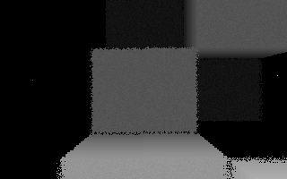

# brainlez Coders! : startrip

A 128 byte DOS intro written by pestis / bC!, submitted to the Lovebyte
2022 128b intro competition.

Source code: https://github.com/vsariola/startrip

Probably DOSBox only.

This sizecategory is just coder porn, normal people should not bother.

Greets to superogue, HellMood, TomCat, baze, Ped7g, byteobserver, ttg,
DevEd/AYCE, Dresdenboy, Kuemmel, Harekiet, unlord, DrClaw.

## Building

You need [nasm](https://nasm.us/). Then:

```
nasm startrip.asm -fbin -o startrip.com
```

or just run the `build.bat`.

## Statistics

- Init (IRQ, mode, palette): 27 bytes
- MIDI initialization code & data: 17 bytes
- Visuals: 46 bytes
- Music player & syncer: 23 bytes
- Song data: 15 bytes
- **Total: 128 bytes**

## Technical

- The music is just linear array of note numbers, with a single byte
  index changing every interrupt. However, as the interrupt is running
  at 18.2 Hz, a simple `dec byte [time]` would result in a very fast
  tempo. Instead, we do the equivalent of `add byte [time], 17`. The
  important property of 17 is that 15 * 17 = 255 = -1, so the net effect
  of 15 cycles is to decrease the time by one, while in between, the
  time is a large value outside the array. Since the array is last in
  the program, at least DOSBox guarantees it's all zeros.
- During initialization, we dump the whole code & data to MIDI port,
  with rep outsb. It setups the instruments and starts playing that low
  frequency bass.
- The visuals are a run-of-the-mill raycaster, drawing heavily from
  [Essence 64b](https://www.pouet.net/prod.php?which=83204). The
  blinking "stars" are just a happy coincidence: the interrupt does not
  save/restore registers, so the raycaster calculations are screwed up
  every now and then.
- The interrupt mutates the main code in two places: it decreases the Z
  to make the camera move forward with time. It also mutates the
  instruction that advances each ray in the inner loop of the raycaster:
  it puts the current note value there. Value of -1 means that no note
  is played. Value of -1 in the raycaster means the normal behaviour:
  each ray advances by one unit in Z every raycasting step. This
  glitches out the raycaster whenever we hit a note, giving the nice
  sync. Yes, this was totally found out by experimentation.
- There is custom grayscale palette. Not sure if it was worth it.

License: [MIT](LICENSE)

